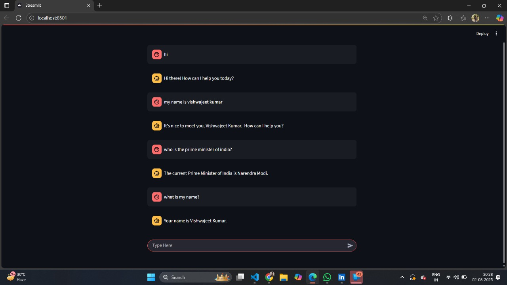

LangGraph + Gemini AI Chatbot with Streamlit

This repository contains a conversational AI chatbot built with LangGraph, Google Gemini Pro, LangSmith, and Streamlit. It demonstrates how to create a stateful, memory-enabled chatbot using a state graph. The project includes multiple Streamlit frontends, including a database-backed version for persistent storage.

✨ Features

Stateful Conversations: Uses LangGraph's StateGraph and InMemorySaver to manage conversation flow and maintain memory across interactions.

LLM Integration: Powered by Google Gemini 1.5 Flash through langchain-google-genai.

LangSmith Integration: Added LangChain Tracing V2 for advanced logging and tracing of conversation runs.

CONFIG = {
    'configurable': {'thread_id': st.session_state['thread_id']},
    'metadata': {'thread_id': st.session_state['thread_id']},
    'run_name': 'chat_turn',
}
LANGCHAIN_TRACING_V2 = True
LANGCHAIN_ENDPOINT = "https://api.smith.langchain.com"
LANGCHAIN_PROJECT = "ChatBot_Project_1"
LANGCHAIN_API_KEY = "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"

Multiple Frontend Examples:

streamlit_frontend.py: Basic, non-streaming interface.

streamlit_frontend_streaming.py: Real-time streaming responses.

streamlit_frontend_threading.py: Supports multiple threads and session memory.

streamlit_frontend_database.py: Database-backed frontend for persistent threads.

Database-Backed Backend: Stores conversation threads for session persistence via a checkpointer.

def retrieve_all_threads(): 
    """Retrieve all threads from the database."""
    all_threads = set()
    for checkpoint in checkpointer.list(None):
        all_threads.add(checkpoint.config['configurable']['thread_id'])
    return list(all_threads)

🚀 How It Works

Two main backend/frontend modes:

In-Memory Mode (Original)

Uses langgraph_backend.py

Conversation stored in memory/session state

Frontends: streamlit_frontend.py, streamlit_frontend_streaming.py, streamlit_frontend_threading.py

Database-Backed Mode (New)

Uses langgraph_database_backend.py + streamlit_frontend_database.py

Persistent storage of threads across restarts

Integrated with LangSmith (LangChain Tracing V2) for run tracking

🗂️ Project Structure
.
├── .env                            # Stores API keys (Google AI, LangChain/Smith)
├── langgraph_backend.py            # Core LangGraph logic and Gemini setup (in-memory)
├── langgraph_database_backend.py   # Database-backed backend (new)
├── requirements.txt                # Python dependencies
├── streamlit_frontend.py           # Basic UI (non-streaming)
├── streamlit_frontend_streaming.py# Streaming UI
├── streamlit_frontend_threading.py# Streaming + multi-threading
├── streamlit_frontend_database.py # Database + LangSmith integration

🛠️ Setup and Usage
1. Prerequisites

Python 3.8+

Google AI API Key

LangChain/Smith API Key (for LangSmith integration)

2. Clone the Repository
git clone https://github.com/Vishwajeet3007/Agentic-AI-Using-LangGraph.git
cd Agentic-AI-Using-LangGraph/ChatBot_In_LangGraph

3. Install Dependencies
python -m venv venv
source venv/bin/activate  # Windows: venv\Scripts\activate
pip install -r requirements.txt

4. Configure Environment Variables

Create a .env file:

GOOGLE_API_KEY="YOUR_GOOGLE_AI_API_KEY"
LANGCHAIN_API_KEY="YOUR_LANGCHAIN_API_KEY"

5. Run the Application

In-Memory Version:

streamlit run streamlit_frontend_threading.py

Database-Backed Version with LangSmith:

streamlit run streamlit_frontend_database.py

Open your browser at http://localhost:8501.

⚙️ Technology Stack

Backend: LangGraph, LangChain

LLM: Google Gemini 1.5 Flash

Frontend: Streamlit

Tracing/Logging: LangSmith (LangChain Tracing V2)

Dependencies: python-dotenv, google-generativeai, langchain

📸 Chatbot Demo

  
